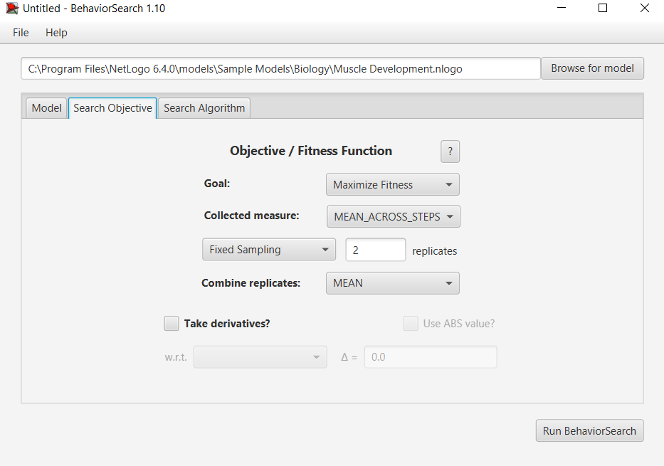
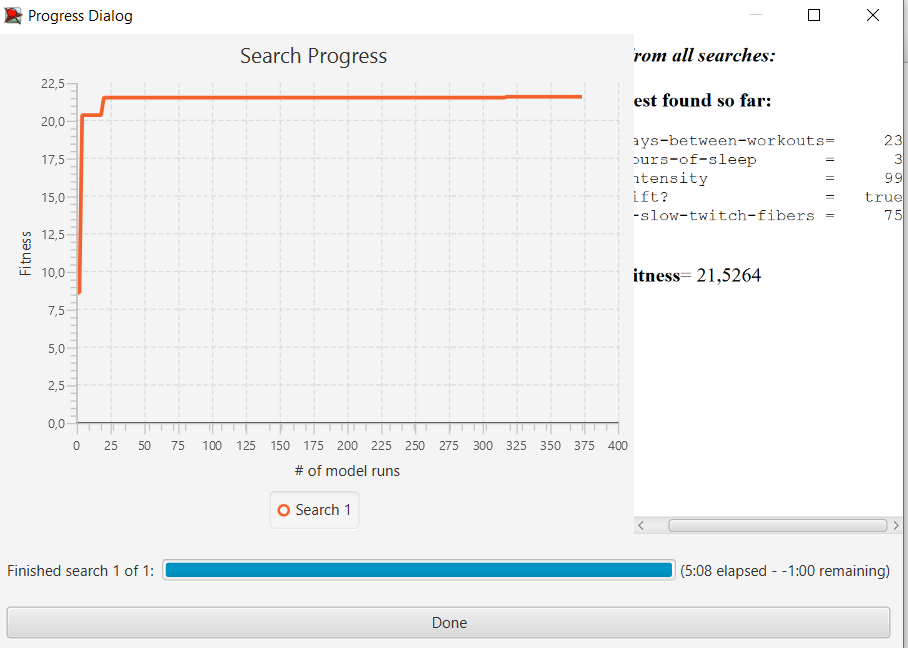

## Комп'ютерні системи імітаційного моделювання
## СПм-22-6, **Лисенко Назар Олександрович**
### Лабораторна робота №**3**. Використання засобів обчислювального интелекту для оптимізації імітаційних моделей

 

### Варіант 12, модель у середовищі NetLogo:

- **(https://github.com/nazar-lysenko-nure/laba1)**

 

### Налаштування середовища BehaviorSearch:

**Обрана модель**:
<pre>
C:\Program Files\NetLogo 6.4.0\models\Sample Models\Biology\Muscle Development.nlogo
</pre>
**Параметри моделі**:  
<pre>
["days-between-workouts" [1 1 30]]
["hours-of-sleep" [0 0.5 12]]
["intensity" [50 1 100]]
["lift?" true false]
["%-slow-twitch-fibers" 75]
</pre>
Використовувана **міра**:  
Для фітнес-функції  було обрано **суму розмірів м'язових волокон**,  вираз для її розрахунку взято з налаштувань графіка аналізованої імітаційної моделі в середовищі NetLogo:

  

та вказано у параметрі "**Measure**":

<pre>
muscle-mass / 100
</pre>

Маса м'язових волокон повинна враховуватися **в середньому** за весь період симуляції тривалістю 700 тактів , починаючи з 0 такту симуляції.  
Параметр зупинки за умовою ("**Stop if**") не використовувався.  
Загальний вигляд вкладки налаштувань параметрів моделі:  

**Налаштування цільової функції**:  
Метою підбору параметрів імітаційної моделі, що описує процеси росту та розвитку м'язової тканини в організмі, є **максимізація** значення суми розмірів м'язових волокон – це вказано через параметр "**Goal**" зі значенням **Maximize Fitness**. **%-slow-twitch-fibers** на початку виставлено в значення в 75%, для того щоб шукати ідеальні значення параметрів при поганій генетиці.
Тобто необхідно визначити такі параметри налаштувань моделі, у яких сума розмірів м'язових волокон є максимальною. При цьому цікавить не просто маса м'язових волокон у якийсь окремий момент симуляції. Для цього у параметрі "**Collected measure**", що визначає спосіб обліку значень обраного показника, вказано **MAEN_ACROSS_STEPS**.  
 **Кожна симуляція повторюється по 2 рази** адже вплив випадковості незначний.
Загальний вигляд вкладки налаштувань цільової функції:  

**Налаштування алгоритму пошуку** (вкладка Search Algorithm):  
Загальний вид вкладки налаштувань алгоритму пошуку:  

 

### Результати використання BehaviorSearch:
Діалогове вікно запуску пошуку:  

Результат пошуку параметрів імітаційної моделі, використовуючи **генетичний алгоритм**:  

Результат пошуку параметрів імітаційної моделі, використовуючи **випадковий пошук**:  

